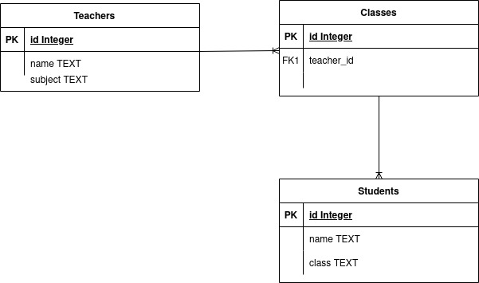

### Teacher
- id INTEGER PRIMARY KEY
- name TEXT
- subject TEXT

### Student
- id INTEGER PRIMARY KEY
- name TEXT
- class TEXT

### Classes
- id INTEGER PRIMARY KEY
- teacher_id INTEGER
- student_id INTEGER
- FOREIGN KEY (teacher_id) REFERENCES Teacher(id)
- FOREIGN KEY (student_id) REFERENCES Student(id)




---
``` SQL
CREATE TABLE Lehrer (
  id INTEGER PRIMARY KEY,
  name TEXT,
  fach TEXT
);

CREATE TABLE Schueler (
  id INTEGER PRIMARY KEY,
  name TEXT,
  klasse TEXT
);

CREATE TABLE Klassen (
  id INTEGER PRIMARY KEY,
  lehrer_id INTEGER,
  schueler_id INTEGER,
  FOREIGN KEY (lehrer_id) REFERENCES Lehrer(id),
  FOREIGN KEY (schueler_id) REFERENCES Schueler(id)
);
```
